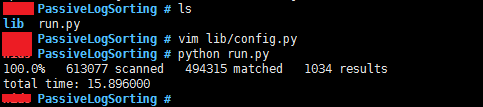
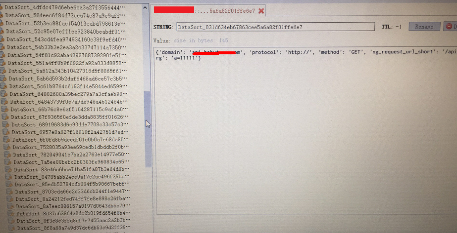

# PassiveLogSorting 0.1

自动化被动扫描系统分为数据源、数据处理、漏洞验证等三个子系统，本系统属于数据处理部分，当流量镜像没权限施行时，可退而求其次，把web日志当作数据源进行分析，并进行过滤去重等操作，发送至消息队列中，等待PassiveSecCheck漏洞验证消费。

## Author ##
咚咚呛 

如有其他建议，可联系微信280495355

## Support ##

满足如下安全需求

	1、支持远程splunk大数据日志的提取和分析
	2、支持自定义规则进行去重、去静态、去相似等方法，已集成部分规则，另一部分规则需要按照场景和日志进行统计设定
	3、支持按照五元素json存储结果到redis(方法、协议、域名、接口、参数)

技术细节如下：

	1、逻辑上日志一般不存储post body，假如存储了，恭喜你可通过日志获取所有接口。
	2、日志使用splunk搭建，并提取相应的字段，分别对应为ng_request_method、ng_status、ng_request_domain、ng_request_url_short、ng_query
	3、、自定义splunk搜索规则保存在redis的中，可动态修改，如去静态资源、去相似url、去敏感域名、任务最大时间、搜索时间等。
	4、去重过滤，计算出MD5(方法+接口)值，利用redis唯一key进行去重
	5、结果redis存储Key是去重md5值，VALUE是json存储的五元素
	6、结果为反复覆盖式存储，可保持请求最新

## Test Environment ##

>centos 7
>
>python 2.7.5

## Tree ##

	PassiveDataSorting
	----lib                #模块库文件
	----run.py		   	   #程序主程序

## Deploy ##
	
	1、任意机子安装redis
	$ yum install redis
	$ vim /etc/redis.conf
	# 更改bind 127.0.0.1 改成了 bind 0.0.0.0
	# 添加一行requirepass xxxxx密码
	# 修改daemonize yes
	$ redis-server /etc/redis.conf
	
	2、配置脚本
	2） $ pip install -r requirements.txt
	3） 配置./lib/config.py 文件，填入Redis和相关规则，后期可以直接在redis进行规则更改添加
	4） $ python run.py
		#可配置成crontab 定时执行，比如1小时执行一次，查询日志中的前5分钟请求。

## Config ##

配置目录：./lib/config.py

	# redis 配置信息
	REDIS_HOST = '127.0.0.1'
	REDIS_PORT = 6379
	REDIS_PASSWORD = 'xxxxxx'
	REDIS_DB = 6
	
	# Splunk配置信息
	SPLUNK_HOST = "10.1.2.10"
	SPLUNK_PORT = 8089
	SPLUNK_SCHEME = "https"
	SPLUNK_USERNAME = "xxxxx"
	SPLUNK_PASSWORD = "xxxxxx"
	
	# query保存查询语句
	# earliest_time查询时间，从现在往前推多长时间
	# max_time 表示任务执行最大时间
	rule = {
	    'query': '''
	        search index=nginx ng_request_method=GET ng_status!=40*
	        |eval ng_request_url_short=lower(ng_request_url_short)
	        |regex ng_request_url_short != "(?i)(.+\.(htm|html|ico|mp3|js|jpg|jped|gif|xml|zip|css|png|txt|ttf|rar|gz))$"
	        |regex ng_request_url_short != "(?i)((\d+){5,})"
	        |rex field=ng_request_url_short mode=sed "s/\/$//g"
	        |stats last(ng_request_domain) last(ng_query) by ng_request_url_short, ng_status, ng_request_method''',
	    'earliest_time': '-1m',
	    'max_time': 60
	}

## Screenshot ##

